<a href="https://rota-naryad.netlify.app">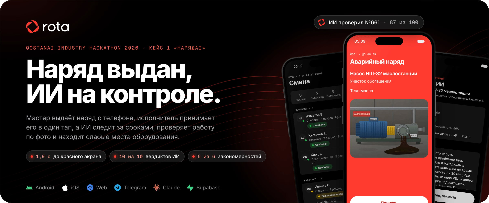</a>

  <b>Work orders with AI control for a mining and processing plant.</b> 
  The мастер issues a наряд from the phone, the worker gets a siren and a red screen, closes the job with a photo,
  and Claude checks the work before the мастер closes it. Every deadline is watched, every closed order is scored,
  and three months of history are searched for the equipment that keeps failing.

  
  
  
  
  
  
  

  <a href="https://rota-naryad.netlify.app"><b>Landing</b></a> ·
  <a href="https://rota-naryad.netlify.app/login"><b>Web panel</b></a> ·
  <a href="https://rota-naryad.netlify.app/app/"><b>Phone app in the browser</b></a> ·
  <a href="https://expo.dev/artifacts/eas/TlD9ou-FgpTX4RRfRIUjpkPEHCZDq6WKPXv5lNiAxJ0.apk"><b>Android APK</b></a> ·
  <a href="docs/case/case1-kostanai-minerals-ru.pdf">Case PDF</a> ·
  <a href="docs/development.md">Run it locally</a>

Built for **АО «Костанайские Минералы»** (chrysotile open pit and processing plant, Житикара, about 2 000 workers in
2 shifts), case 1 «НарядAI: интеллектуальная система выдачи и контроля нарядов». All people in the data are synthetic.

## Open it now

| | Where | Sign in (табельный номер / ПИН) |
| --- | --- | --- |
|  **Android app** | [APK, EAS preview build](https://expo.dev/artifacts/eas/TlD9ou-FgpTX4RRfRIUjpkPEHCZDq6WKPXv5lNiAxJ0.apk) | worker `2001/1234`, master `1001/1111` |
|  **Web panel** | [rota-naryad.netlify.app/login](https://rota-naryad.netlify.app/login) | master `1001/1111`, руководитель `3001/3333`, admin `9001/9999` |
|  **Phone app in the browser** (iPhone too) | [rota-naryad.netlify.app/app/](https://rota-naryad.netlify.app/app/) | the same accounts as the Android app |
|  **Landing** | [rota-naryad.netlify.app](https://rota-naryad.netlify.app) | |
|  **Code** | this repository, setup in [`docs/development.md`](docs/development.md) | |

## Why it wins: the numbers

Every number below was measured on the live project or by the test suite. Click a card for its source.

<table>
  <tr>
    <td align="center"><a href="docs/progress.md">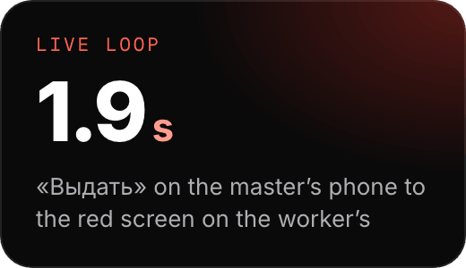</a> <a href="docs/progress.md">progress.md</a>, P7 live check</td>
    <td align="center"><a href="docs/progress.md">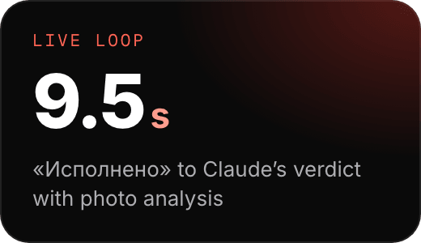</a> <a href="docs/progress.md">progress.md</a>, P7 live check</td>
    <td align="center"><a href="docs/golden-results.md">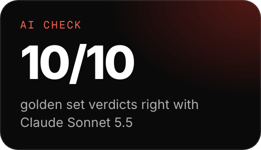</a> <a href="docs/golden-results.md">golden-results.md</a></td>
  </tr>
  <tr>
    <td align="center"><a href="docs/phase6-acceptance.md">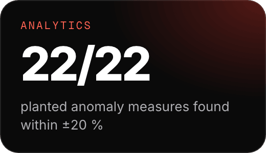</a> <a href="docs/phase6-acceptance.md">phase6-acceptance.md</a> §1</td>
    <td align="center"><a href="docs/phase6-acceptance.md">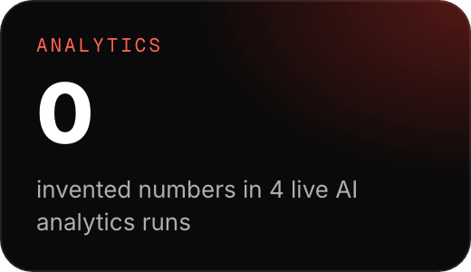</a> <a href="docs/phase6-acceptance.md">phase6-acceptance.md</a> §2</td>
    <td align="center"><a href="docs/phase5-acceptance.md">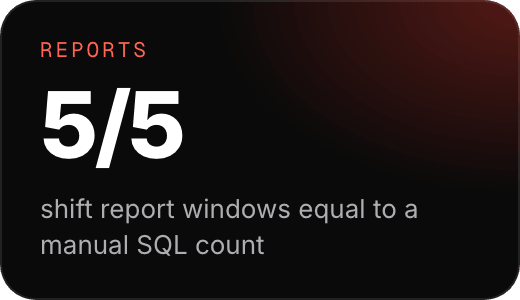</a> <a href="docs/phase5-acceptance.md">phase5-acceptance.md</a> (b)</td>
  </tr>
  <tr>
    <td align="center"><a href="tools/seed/PATTERNS.md">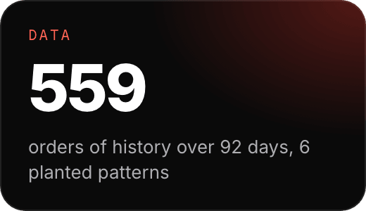</a> <a href="docs/progress.md">progress.md</a>, <a href="tools/seed/PATTERNS.md">PATTERNS.md</a></td>
    <td align="center"><a href="vitest.config.ts">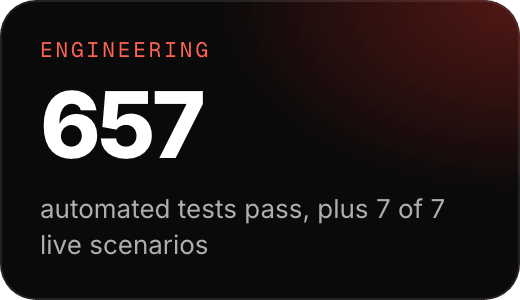</a> <code>npm test</code> (34 files), <a href="docs/progress.md">progress.md</a></td>
    <td align="center"><a href="docs/golden-results.md">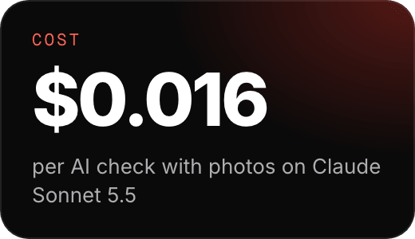</a> <a href="docs/golden-results.md">golden-results.md</a></td>
  </tr>
</table>

## How it works: one наряд, six steps

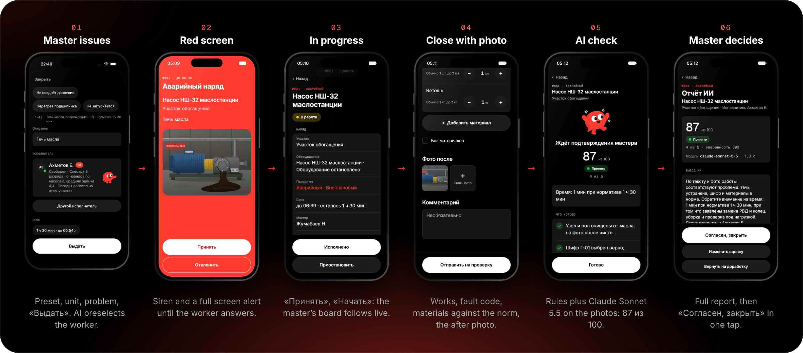

| Step | Who | What happens | Status the other phone sees |
| --- | --- | --- | --- |
| 1 | мастер | «Выдать» → preset «Аварийный» → unit → problem chip → «Выдать». Five taps for the required fields; `suggest_assignees` preselects the free слесарь with the reasons; the deadline comes from the norm of the suggested fault code. | «Выдан» |
| 2 | исполнитель | A looping siren and a full screen red alert that never dismisses itself: «Принять» or «Отклонить» with a reason. | «Принят в работу» |
| 3 | исполнитель | «Начать». One order in progress per worker; an emergency can pause the current one in the same transaction. | «Выполняет наряд №661» |
| 4 | исполнитель | Works done, fault code Г-01, materials against the norm, the after photo (compressed on the phone, hashed, uploaded while the form is filled). | «Проверка ИИ» |
| 5 | AI | SQL rules R1 to R4 plus one Claude Sonnet 5.5 call with the before and after photos: verdict, score, confidence, feedback for the worker. | «Ждёт подтверждения» |
| 6 | мастер | The full report; «Согласен, закрыть», «Изменить оценку» or «Вернуть на доработку». The master has the final word. | «Закрыт» |

Every status change is one `order_events` row with the server's clock, and reaches the other devices through
Supabase Realtime (the case asks for 5 s; the live check measured 1.9 s from «Выдать» to the red screen).

## Screens

<table>
  <tr>
    <td align="center" width="33%">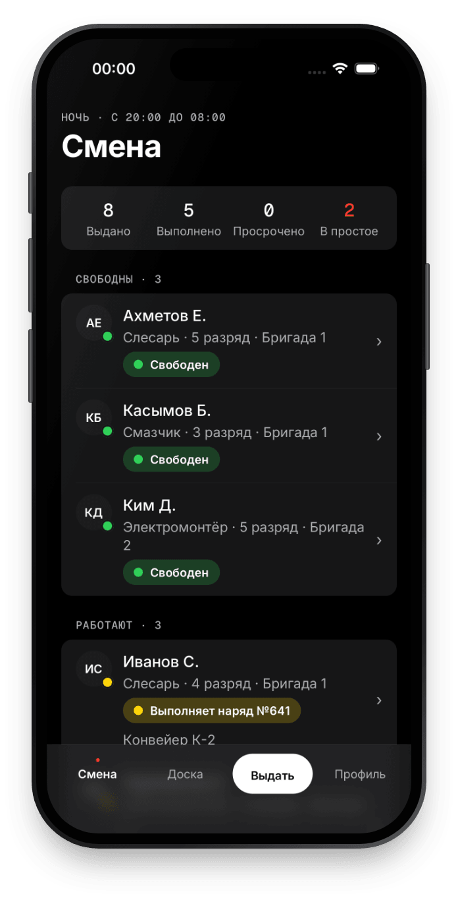 <b>Смена</b> Who is free, busy, queued or off shift, with live counters</td>
    <td align="center" width="33%">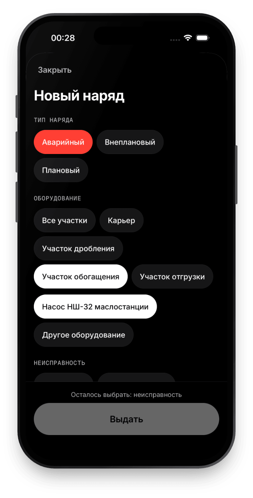 <b>Новый наряд</b> Preset, area, unit, problem: the required fields in five taps</td>
    <td align="center" width="33%">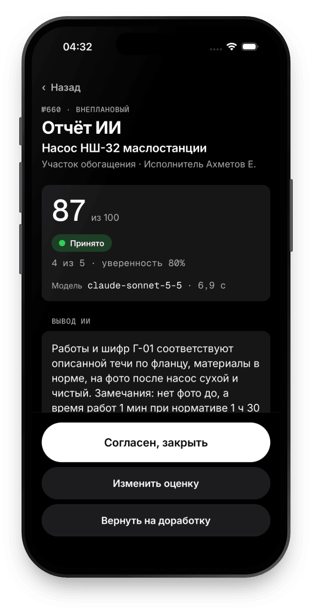 <b>Отчёт ИИ</b> Claude Sonnet 5.5: 87 из 100, confidence 80 %, the model and its latency on screen</td>
  </tr>
  <tr>
    <td align="center">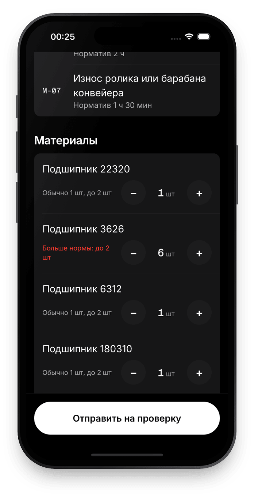 <b>Отчёт о работе</b> Materials against the norm: 6 bearings where the norm is 2 turn red before sending</td>
    <td align="center">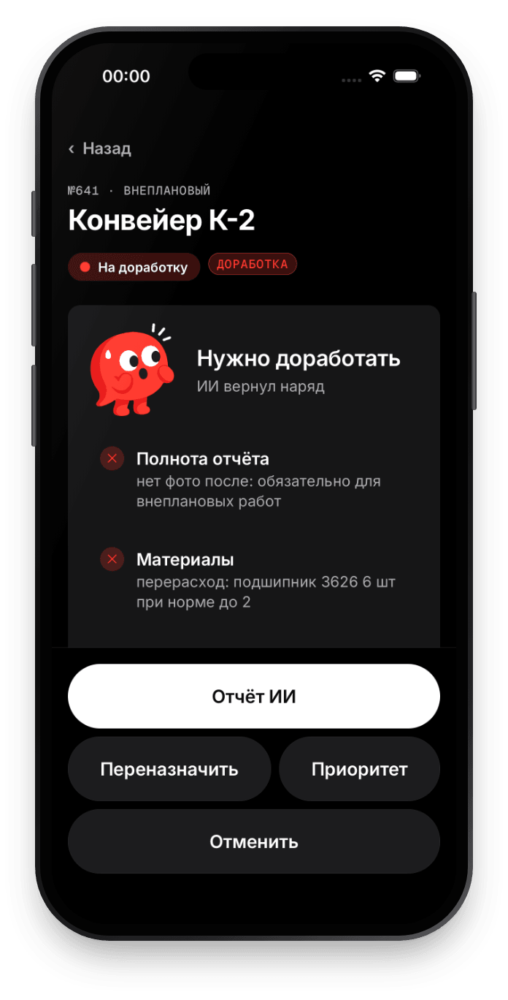 <b>На доработку</b> The AI returns the order with its reasons: no after photo, overspend</td>
    <td align="center">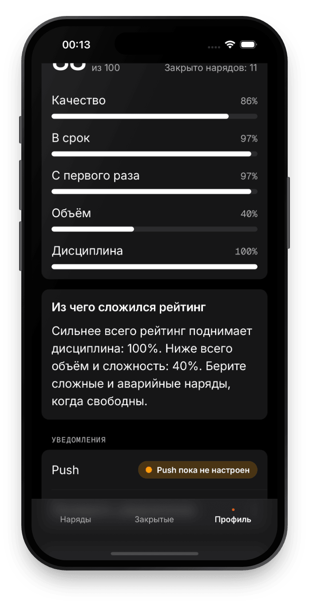 <b>Рейтинг</b> The worker's own score by five components, explained in one paragraph</td>
  </tr>
</table>

<table>
  <tr>
    <td align="center" width="50%">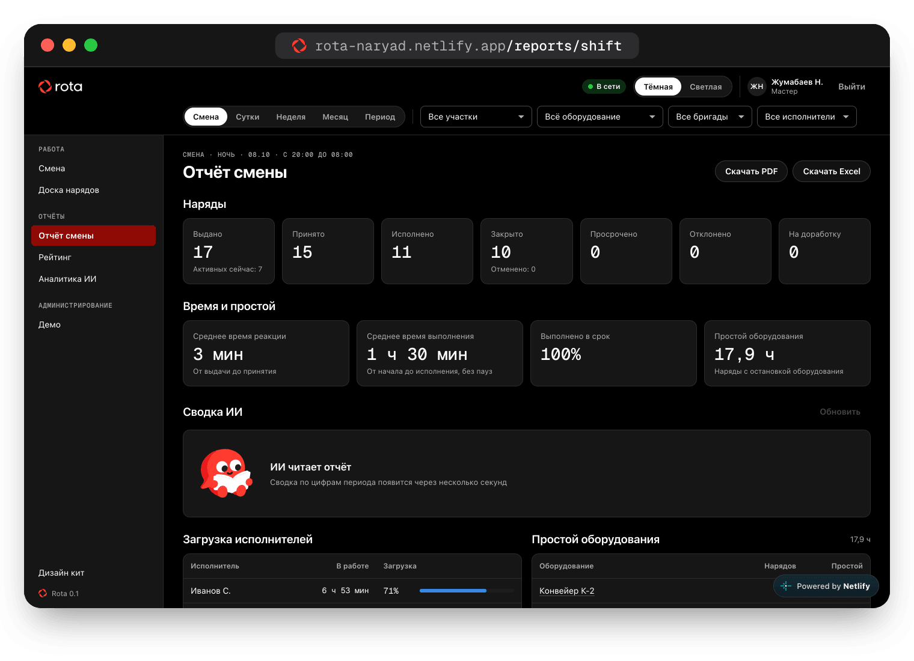 <b>Отчёт смены</b> Counts, reaction and execution time, downtime, workload, AI summary, PDF and Excel</td>
    <td align="center" width="50%">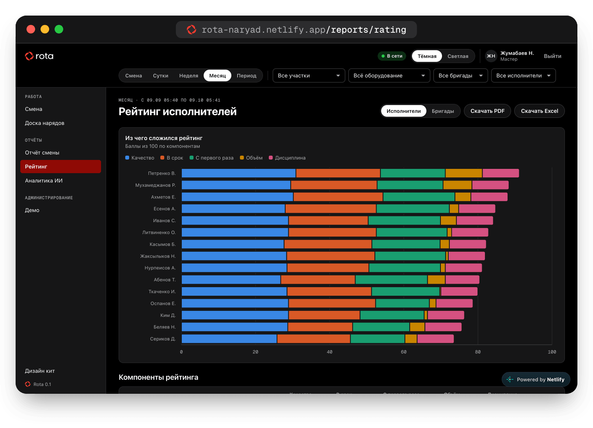 <b>Рейтинг исполнителей</b> Workers and brigades for any period, stacked by quality, on time, first time fix, volume, discipline</td>
  </tr>
  <tr>
    <td align="center">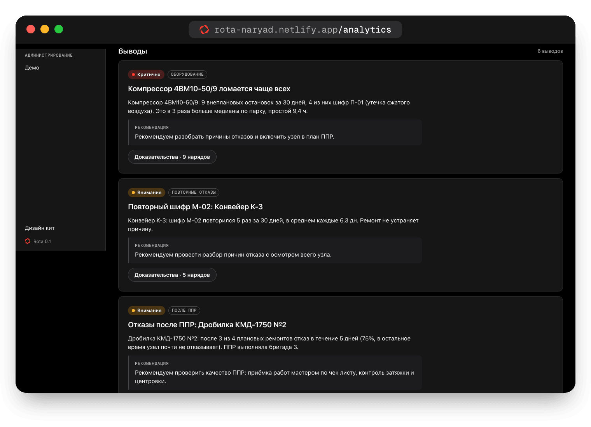 <b>Аналитика ИИ</b> Findings with a recommendation and the orders behind every number</td>
    <td align="center">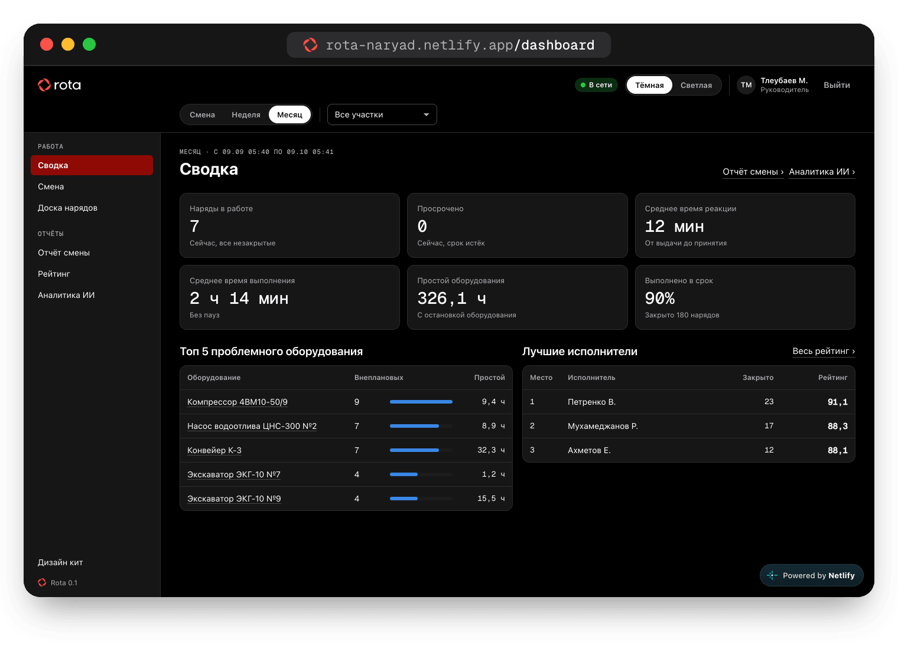 <b>Сводка руководителя</b> Active and overdue now, reaction, execution, downtime, top 5 units, best workers</td>
  </tr>
  <tr>
    <td align="center">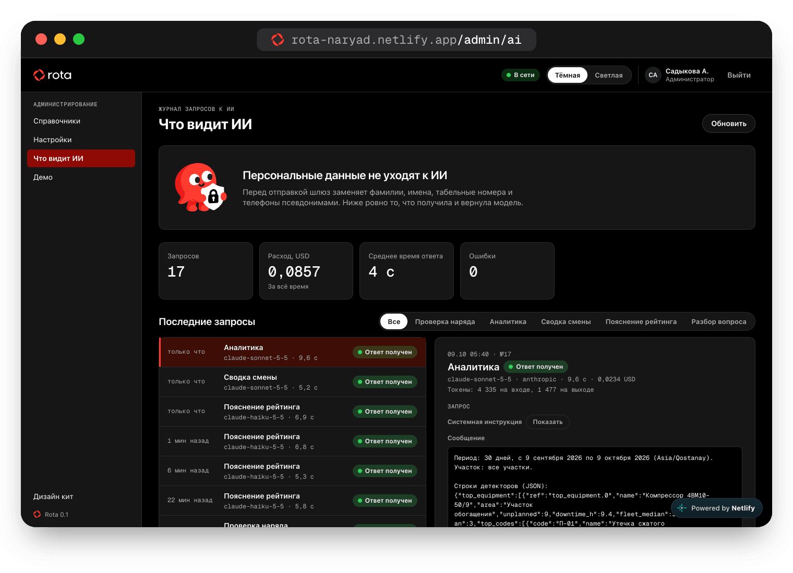 <b>Что видит ИИ</b> Every LLM request as it left the plant: pseudonyms only, cost and latency per call</td>
    <td align="center">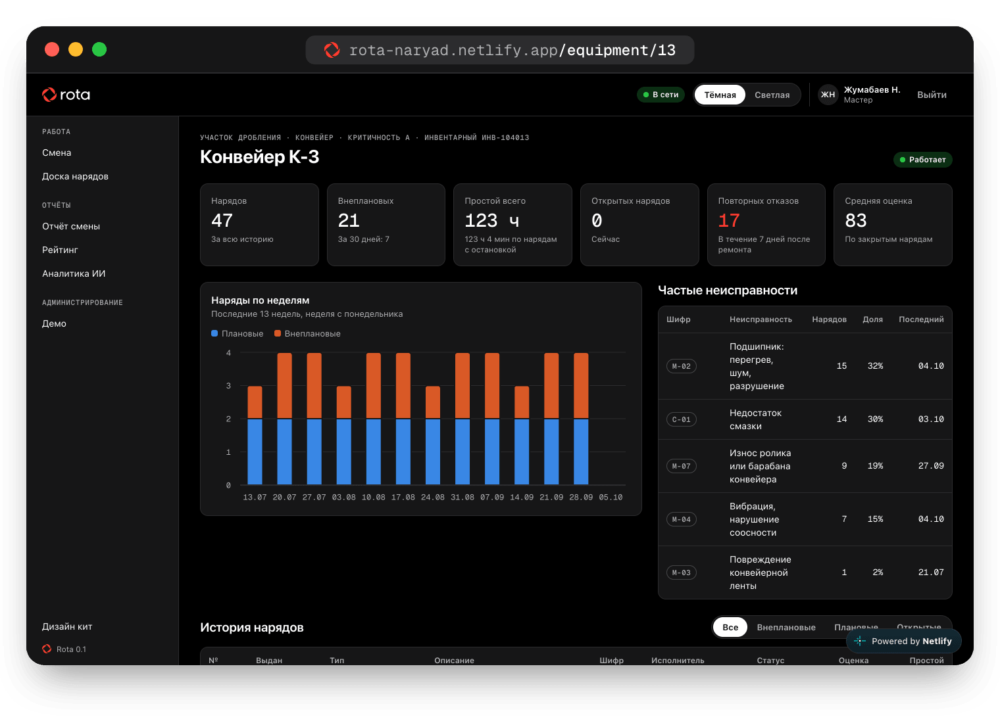 <b>История оборудования</b> Конвейер К-3: every order, repeat failures, total downtime</td>
  </tr>
</table>

More shots, all on real data: [`docs/screenshots/presentation/`](docs/screenshots/presentation/README.md).

## The AI: rules decide, Claude judges, the мастер signs

<picture><source media="(prefers-color-scheme: dark)" srcset="packages/design/assets/mascots/dark/check.svg"></picture>

Every closed наряд gets an explainable score out of 100 (CLAUDE.md §11).

| Part | Points | Decided by |
| --- | --- | --- |
| R1 completeness: works text, fault code, materials, after photo | 20 | SQL |
| R2 photo integrity: camera, taken during the work, not a duplicate of another order (dHash, sha256) | 10 | SQL |
| R3 materials against the norm and the historical p90 | 15 | SQL |
| R4 time against the norm, deadline kept | 20 | SQL |
| L1 the works match the problem, the code fits the works | 20 | Claude Sonnet 5.5 |
| L2 the after photo: same unit, problem gone, neat, guards in place | 15 | Claude Sonnet 5.5 with vision |

- **Hard failures are deterministic.** Any rule fail means «На доработку», whatever the model says. Then ≥ 80 is
  «Принято», 60 to 79 «Принято с замечаниями», below 60 «На доработку».
- **Doubt goes to a human.** Confidence below 0.6, a model error or the budget cap sends the order to the мастер as
  «Нужна проверка мастером»; the rules only review keeps working without the model.
- **Tested before trusted.** The golden set of 10 cases (good repair, no after photo, duplicate photo, excess
  materials, wrong code, unrelated works, too fast, late but good, planned without photo, unclear photo) scores
  **10 из 10** live on Sonnet 5.5 at about 0.016 USD a case ([results](docs/golden-results.md)).
- **One call, schema bound.** Sonnet 5.5 with a JSON schema, effort low, a 45 s timeout; Haiku 5.5 reads questions
  and explains ratings. A budget guard (`LLM_BUDGET_USD`) stops paid calls before the cap.

## Deadline control: the watchdog

<picture><source media="(prefers-color-scheme: dark)" srcset="packages/design/assets/mascots/dark/search.svg"></picture>

`pg_cron` runs `internal.watchdog_tick()` every 5 seconds inside Postgres, so no phone has to stay awake.

| Trigger | Who is told | Default |
| --- | --- | --- |
| Not accepted in time | мастер, with the best other candidate and a one tap «Переназначить на …»; the worker gets a reminder | 10 min, emergency 3 min |
| Deadline close | the worker | 30 min before, or half the time for short orders |
| Overdue | the worker and the issuing мастер, repeated | every 15 min |
| Long overdue | every руководитель | after 60 min |
| AI check stuck | `ai-verify` is called again through `pg_net` | after 60 s, up to 5 times |

Messages follow the case format: «Наряд №{n} просрочен на {mins} мин. {equipment}, {area}. Исполнитель: {short_name}.
Статус: {status_label} с {HH:MM}. Последний комментарий: “{last_comment}”.» They show real elapsed minutes. Thresholds
live in `settings` and change on the admin screen; «Ускорение времени ×10» exists to show an escalation on stage.

## Notifications

| Channel | How |
| --- | --- |
|  Push | Expo push service over FCM V1; channels `orders` (ding), `emergency` (siren, max importance), `reminders`; actions «Принять» and «Открыть» |
|  In the app | Realtime toast, haptic and sound; a new emergency opens the red screen with a looping siren until the worker answers |
|  Telegram | second channel through the bot, linked by a 15 minute token; messages carry the order number, unit, area, status and deadline, never a name |

The pipeline is an outbox: a row in `notifications` (deduplicated per recipient), a trigger, `pg_net`, the
`notify-dispatch` Edge Function. Status today: the in-app alerts, the red screen and Telegram work on the live project;
remote push on Android waits for the Firebase key in EAS (the open item of P3 in [`docs/progress.md`](docs/progress.md)).

## Analytics: the history tells on the equipment

<picture><source media="(prefers-color-scheme: dark)" srcset="packages/design/assets/mascots/dark/read.svg"></picture>

The synthetic history (559 orders over 92 days, generated inside the database) carries six planted patterns with an
answer key ([`tools/seed/PATTERNS.md`](tools/seed/PATTERNS.md)). SQL detectors find them; Claude writes the cards from
those numbers only, and a checker drops any card with a number that is not in the data.

| | Pattern | Found on the live project |
| --- | --- | --- |
| P1 | Конвейер К-3 breaks most | 21 unplanned failures in 92 days, 3× the fleet median, 15 of them М-02 (bearing), 87 h downtime; in the last 30 days exactly 7 stops, 5 of them М-02, the case's own example |
| P2 | One слесарь's repairs do not hold | Сериков Д.: 41 % of repairs followed by the same fault within 7 days against 14 % for the team; last of 15 in the rating, first time fix 64.7 % against a team median of 91.3 % |
| P3 | Failures right after ППР | Дробилка КМД-1750 №2: 8 of 13 ППР (62 %) followed by a failure within 5 days, 17 % otherwise (lift 3.6), all 13 by бригада 3 |
| P4 | Night electrical faults | Участок обогащения: 13 Э faults at night against 5 by day (2.6×), half of them 02:00 to 05:00 |
| P5 | Grease overspend | бригада 1: Литол-24 on С-01 at 2.2× the norm (1.75 kg against 0.8) over 55 orders |
| P6 | A failure trend | Насос водоотлива ЦНС-300 №2: 0, 1, 1, 1, 2, 3 failures over the last 6 weeks, slope 0.51 a week |

All 22 measures land within ±20 % of the key ([acceptance](docs/phase6-acceptance.md)). The ask box takes plain
Russian: «покажи проблемы участка дробления за месяц» is read by Haiku as участок дробления, 30 days. Reports share one
filter (смена, сутки, неделя, месяц, период, участок, оборудование, исполнитель, бригада), export to
 PDF and  Excel,
and the shift report equals a manual SQL count in all five windows checked ([acceptance](docs/phase5-acceptance.md)).
A weekly digest goes to masters and the руководитель every Monday at 08:00.

## Architecture

Everything runs on Supabase: hosted for the hackathon, self hosted on the plant's servers in production. The full page,
with every call drawn and the job of each part: [`docs/architecture.md`](docs/architecture.md).

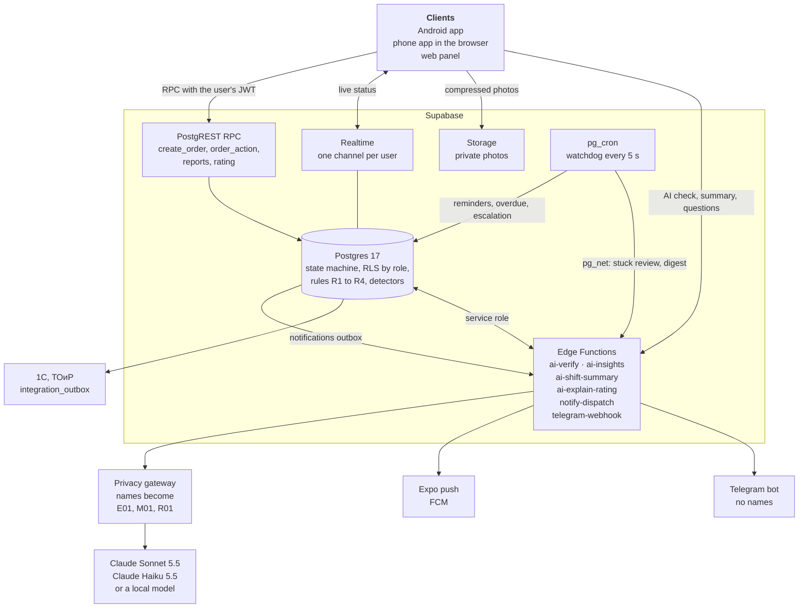

  &nbsp;
  &nbsp;
  &nbsp;
  &nbsp;
  &nbsp;
  &nbsp;
  &nbsp;
  &nbsp;
  &nbsp;
  &nbsp;
  

| Layer | Stack |
| --- | --- |
| Phone | Expo SDK 57, React Native 0.86, React 19.2.3, TypeScript 6, expo-router, React Query, zustand; development builds, never Expo Go |
| Web | Vite, React 19.2.3, CSS modules on the Rota tokens, recharts, pdfmake (Cyrillic), exceljs |
| Backend | Supabase: Postgres 17, Auth, Realtime, Storage, Edge Functions (Deno), pg_cron, pg_net, Vault |
| AI | Claude Sonnet 5.5 (verification with vision, insight cards, shift summary) and Haiku 5.5 (question parsing, rating explanations) through one `fetch` only client with providers `mock`, `anthropic`, `openai_compatible` |
| Design | the Rota design system: dark canvas, signal red `#FF3B30`, Inter and Geist Mono, 24 mascots, glove mode (64 px primary buttons, 56 px targets) |

## Built for the plant, not for the demo

<picture><source media="(prefers-color-scheme: dark)" srcset="packages/design/assets/mascots/dark/shield.svg"></picture>

**Personal data stays at the plant.** Before any LLM call `_shared/privacy.ts` replaces surnames (with Russian and
Kazakh case endings), «Фамилия И.» forms, табельные номера and phone numbers with pseudonyms (`E01`…`E15`, `M01`,
`M02`, `R01`, `A01`) and puts the names back only in the answer. The redacted request is stored in `llm_audit` and shown
to the admin on «Что видит ИИ». Production runs self hosted Supabase (open source) on the plant's servers or in a
Kazakhstan cloud under Law 94-V, and `LLM_PROVIDER=openai_compatible` swaps Claude for a local model behind the same
gateway.

**Integration with 1С and ТОиР.** Every table is a REST endpoint through PostgREST. A trigger writes `order.created`
and `order.closed` (with the material lines) to `integration_outbox`, the seam for 1С:ТОИР documents: заявка на
ремонт, акт выполненных работ, требование накладная на материалы.

**Security by construction.** Login by табельный номер and ПИН; the role comes from the JWT (`app_metadata.app_role`)
and every table has row level security. The client never updates `orders`: every change goes through the security
definer RPCs `create_order` and `order_action`, with the server's clock and an idempotency key (`client_action_id`)
that also makes an offline outbox possible. `order_events` is append only. The apps ship only the project URL and the
publishable key; `anon` cannot execute any RPC (checked by [`supabase/tests/transitions.sql`](supabase/tests/transitions.sql)).

**Sized for 2 000 workers in two shifts.** One Realtime channel per signed in user, indexed views for the worker
status, reports and detectors computed in SQL next to the data, photos compressed on the phone to at most 1600 px
before upload.

**Reliability first.** The state machine lives in SQL and is mirrored in TypeScript for the UI and the offline mock;
a parity test keeps them equal. Realtime resubscribes and refetches on every foreground and reconnect; the AI check
falls back to rules only when the model is off or over budget.

## Estimated effect

> **Estimates, not measurements.** The assumptions are ours; replace them with the plant's own figures.

| Lever | Assumption | Estimate |
| --- | --- | --- |
| Dispatch | 60 наряды a shift, 2 shifts, 30 days = 3 600 a month. Finding a free слесарь by radio or phone takes 4 min; with the shift screen and the AI suggestion, 1 min. | 3 min × 3 600 ≈ **180 master hours a month** |
| Paperwork | A paper наряд, its closing act and retyping into 1С take 8 min per order; closing on the phone with the 1С outbox leaves 2 min. | 6 min × 3 600 ≈ **360 hours a month** |
| Repeat failures | In the history, Конвейер К-3 lost 87 h to 21 unplanned failures in 92 days, 15 of them the same bearing code. Acting on the AI card removes half of those repeats (about 7 failures, 4.1 h each). | ≈ **29 h of conveyor downtime a quarter**, for one unit; multiply by the plant's cost of an hour of downtime |
| Reaction | An unaccepted emergency escalates after 3 min with a named replacement, instead of when someone notices. | not quantified |

## Try it in two minutes

1. Open the [phone app](https://rota-naryad.netlify.app/app/) in one browser window and sign in as мастер
   `1001 / 1111`. «Смена» shows who is free, who works, who is off shift.
2. Open it again in a second browser (or on a phone, or install the
   [APK](https://expo.dev/artifacts/eas/TlD9ou-FgpTX4RRfRIUjpkPEHCZDq6WKPXv5lNiAxJ0.apk)) and sign in as исполнитель
   `2001 / 1234`.
3. As the мастер, issue an emergency наряд: «Выдать», «Аварийный», the unit «Насос НШ-32 маслостанции» (the area chip
   «Участок обогащения» narrows the list), the problem «Течь масла», «Выдать». The worker's screen turns red.
4. As the worker: «Принять», «Начать», «Исполнено»; fill the form, add the after photo, «Отправить на проверку». The
   AI verdict arrives in about ten seconds; the мастер taps «Согласен, закрыть».
5. Open the [web panel](https://rota-naryad.netlify.app/login) as руководитель `3001 / 3333` or мастер `1001 / 1111`:
   «Отчёт смены», «Рейтинг» for «Месяц», «Аналитика ИИ».

«Сбросить демо» on the «Демо» screen (мастер or admin) restores the Demo Day start state.

## Demo video

Video: coming with the Demo Day cut. It will be committed as `docs/video/rota-demo.mp4` and linked from the
[landing](https://rota-naryad.netlify.app). Until then the six step strip above and the
[screenshots](docs/screenshots/presentation/README.md) show the same loop on real data.

<b>The Demo Day script</b> (case §11, about 7 minutes on three phones and the web panel)

Phones: A мастер Жумабаев (1001), B исполнитель Ахметов (2001) in work gloves, C исполнитель Иванов (2002); the laptop
shows the web panel and mirrors A and B.

1. A: the shift panel shows who is free, busy, queued and off shift; the board shows the active orders.
2. A: photographs the oil leak on «Насос НШ-32 маслостанции» and issues an emergency order; the AI preselects Ахметов
   with reasons; the tap counter stays at the required five.
3. B: siren and the red screen; «Принять», «Начать». A sees «Выполняет наряд №…» within seconds.
4. A: a second order to Ахметов with the «1 мин» deadline; B puts it in the queue. The reminder fires at 30 s left,
   the overdue message reaches both phones within 5 s of the deadline.
5. B: closes the first order with Г-01, Кольцо уплотнительное 2 шт, Масло ВМГЗ 2 л, Ветошь 1 кг and the after photo.
6. The AI check: leak gone, same unit, materials within the norm → «Принято»; A taps «Согласен, закрыть».
7. C: closes the К-2 bearing order without a photo and with 6 bearings → «Требует доработки» with both reasons.
8. Web: the shift report with the AI summary, the rating of workers and brigades for «Месяц».
9. Web: analytics over three months finds P1 to P5; the ask box answers «покажи проблемы участка дробления за месяц».

## Repository map

| Path | What is inside |
| --- | --- |
| [`apps/mobile`](apps/mobile) | Expo app for мастер, исполнитель and руководитель; routes in `src/app/`, the glove sized kit in `src/ui/`; also exported as the browser app |
| [`apps/web`](apps/web) | Vite panel and the landing: shift, board, orders, reports, rating, analytics, dashboard, equipment, admin, demo |
| [`packages/shared`](packages/shared) | domain types, the transition table, verify rules, rating formula, notification templates, Russian strings, `RotaApi` with `MockApi` and `SupabaseApi`, live sync |
| [`packages/design`](packages/design) | Rota tokens, status colors, theme, logo, 24 mascots, platform logos |
| [`supabase/migrations`](supabase/migrations) | 13 migrations: schema, RLS, state machine, watchdog, reports, detectors, AI scoring, cron, dispatch |
| [`supabase/functions`](supabase/functions) | Edge Functions and `_shared/` (LLM client, privacy gateway, prompts, schemas, pricing) |
| [`supabase/seed`](supabase/seed), [`tools/seed`](tools/seed) | test accounts, the history generator run, the answer key of the planted patterns |
| [`supabase/tests`](supabase/tests) | SQL acceptance scripts and `transitions.json` |
| [`tools`](tools) | Node scripts: golden set, LLM smoke test, push test, database check, acceptance checks, README assets |
| [`docs`](docs) | [development guide](docs/development.md), [architecture](docs/architecture.md), [decisions](docs/decisions.md), [design](docs/design.md), [progress](docs/progress.md), acceptance reports, the case PDF |
| [`CLAUDE.md`](CLAUDE.md) | the engineering spec every phase was built against |

## Deliverables (case §12)

| | Deliverable | Where |
| :---: | --- | --- |
| ✓ | Repository with run instructions | this README and [`docs/development.md`](docs/development.md) |
| ✓ | Android APK, and a PWA link | [APK](https://expo.dev/artifacts/eas/TlD9ou-FgpTX4RRfRIUjpkPEHCZDq6WKPXv5lNiAxJ0.apk) · [rota-naryad.netlify.app/app/](https://rota-naryad.netlify.app/app/) |
| ✓ | Web panel and test accounts (мастер, исполнитель, руководитель) | [rota-naryad.netlify.app/login](https://rota-naryad.netlify.app/login) · 1001/1111, 2001/1234, 3001/3333 |
| ✓ | Test dataset | [`supabase/seed/`](supabase/seed) and [`tools/seed/PATTERNS.md`](tools/seed/PATTERNS.md) |
| ✓ | Architecture | [`docs/architecture.md`](docs/architecture.md) |
| ○ | Presentation of at most 10 slides | in progress; screens ready in [`docs/screenshots/presentation/`](docs/screenshots/presentation/README.md) |
| ○ | Demo video of at most 3 minutes | in progress, see [Demo video](#demo-video) |

## Credits and license

Built by [@k4ssymzhomart](https://github.com/k4ssymzhomart) for the Qostanai Industry Hackathon 2026, case 1 of
АО «Костанайские Минералы». Design: the Rota design system and its mascots. AI: Claude by Anthropic. Fonts: Inter and
Geist Mono (SIL Open Font License). Platform marks come from Simple Icons (CC0) and belong to their owners; they only
say where Rota runs and what it connects to.

No open source license is granted yet: all rights reserved by the author. The case materials belong to the organizers
and АО «Костанайские Минералы». Every person in the data is synthetic. The README assets are rebuilt with
`npx tsx tools/gen-readme-assets.ts`.

 Наряд выдан, ИИ на контроле

