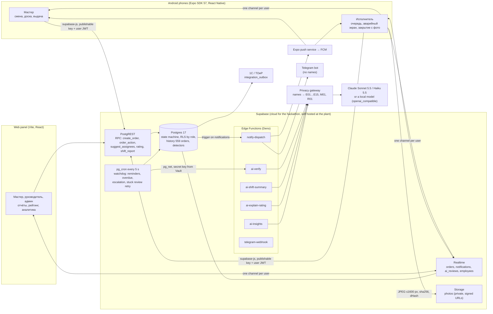

# Rota · architecture

Rota (case «НарядAI», АО «Костанайские Минералы»): a master issues a work order from a phone, the worker accepts and closes it with a photo, AI watches the deadline and checks the result, analytics find the repeating failures. This page is the one picture of how the parts fit, for the jury slide and for the plant's IT.

## The picture

## What each part does

| Part | Responsibility | Where |
| --- | --- | --- |
| Mobile app | master and worker flows, glove sized UI, emergency screen with siren, photo pipeline, realtime | `apps/mobile` |
| Web panel | shift, board, reports with PDF and Excel, rating, AI analytics, dashboard, admin, «Что видит ИИ» | `apps/web` |
| Shared package | domain types, the state machine table, verify rules, rating formula, Russian strings, `RotaApi` with `MockApi` and `SupabaseApi`, live sync | `packages/shared` |
| Design package | Rota tokens, industrial status colors, theme, logo and 24 mascots | `packages/design` |
| Postgres | every order mutation goes through `create_order` / `order_action` (server clock, idempotent by `client_action_id`), RLS by role, views, reports, detectors | `supabase/migrations` |
| Watchdog | every 5 s: not accepted → escalation with the best candidate, reminder before the deadline, overdue to worker and master, long overdue to the manager, retry of a stuck AI check | migration `rota_watchdog` |
| ai-verify | rules R1 to R4 in SQL decide hard failures; one Sonnet call with the before and after photos adds the judgement; the master has the final word | `supabase/functions/ai-verify` |
| Notifications | outbox table → trigger → `notify-dispatch` → Expo push (channels: orders, emergency with siren, reminders) and Telegram | `supabase/functions/notify-dispatch` |
| Privacy gateway | redacts names, tab numbers and phones before any LLM call; `llm_audit` keeps the redacted request | `supabase/functions/_shared/privacy.ts` |

## Decisions that matter to the plant

- **Explainable AI.** Deterministic rules decide failures (no photo after unplanned work, overspend, photo taken outside the work window, duplicate photo); the model adds the judgement and its confidence; below 0.6 the master reviews. Golden set accuracy is tracked in `docs/golden-results.md`.
- **Personal data stays at the plant.** The LLM sees pseudonyms only. Production runs self hosted Supabase (open source) on the plant's servers or a KZ cloud (Law 94-V), and the LLM provider switch (`LLM_PROVIDER=openai_compatible`) puts a local model behind the same gateway.
- **Reliability first.** Server time is the only clock; every mutation is idempotent; realtime resyncs on foreground and reconnect; the rules only review keeps working when the LLM is off or over budget.
- **Integration.** `integration_outbox` receives `order.created` and `order.closed` (with materials) for 1С:ТОИР (заявка на ремонт, акт выполненных работ, требование накладная).
- **Scale.** About 2 000 workers in 2 shifts: one realtime channel per signed in user, indexed views, reports computed in SQL; the hackathon instance holds 3 months of history (559 orders) with planted patterns P1 to P6.
