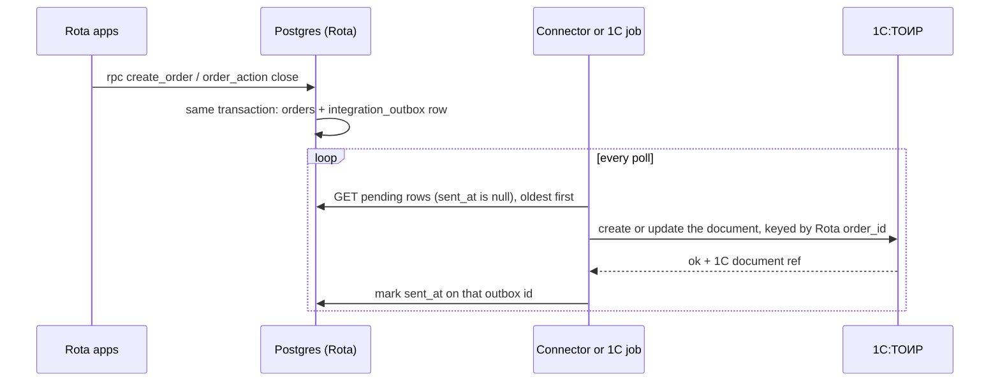

# Rota · integration with 1С and ТОиР

The case asks for an architecture that «позволяет в будущем интеграцию с 1С / ERP / системой ТОиР предприятия» (case §9). This page is for the plant's IT and its 1С team. It covers how orders leave Rota, the exact payloads, how each field maps to the three 1С:ТОИР documents (заявка на ремонт, акт выполненных работ, требование-накладная на материалы), how directories come back from 1С, how the exchange is secured, and what exists in code today against what a pilot adds.

**Status, 2026-10-09.** The Rota side of the seam is built: the outbox table, the two triggers that fill it in the same transaction as the order change, RLS, and a SQL test. Nothing consumes the outbox yet: no connector, no 1С processing, and nothing sets `sent_at`. Section 7 has the full list.

## 1. What exists in code today

| Piece | What it does | Where |
| --- | --- | --- |
| `public.integration_outbox` | `id` (identity), `created_at`, `topic`, `payload jsonb`, `sent_at` (null until delivered); partial index `integration_outbox_pending_idx (created_at) where sent_at is null` | `supabase/migrations/20261008100002_rota_schema.sql` |
| Trigger `orders_outbox_insert` | after insert on `orders`: one `order.created` row | `supabase/migrations/20261008100004_rota_state_machine.sql`, function `internal.orders_outbox()` |
| Trigger `orders_outbox_close` | after update of `status` on `orders`, when the status becomes `closed`: one `order.closed` row with the material lines | same function |
| Seeding switch | both triggers do nothing while `rota.seeding = on`, so the generated history and the demo start state write no outbox rows | same function; `internal.generate_history()`, `internal.demo_reset()` in `20261008100007_rota_seed_tools.sql` |
| RLS and grants | policy `integration_outbox_read`: select for signed in users whose role is `admin`; no insert, update or delete for `authenticated`; nothing for `anon`; the secret key (service role) has full access | `supabase/migrations/20261008100003_rota_security.sql` |
| Test | `supabase/tests/transitions.sql` step 10: two closed orders give two `order.closed` rows, and the first one carries its 3 material lines | `supabase/tests/transitions.sql` |
| Natural keys for 1С | `equipment.inventory_no`, `materials.sku`, `employees.tab_no`, `areas.code`, `fault_codes.code` are unique | `20261008100002_rota_schema.sql` |

Checked on the live project on 2026-10-09 with read only queries: the deployed `internal.orders_outbox()` is identical to the migration, both triggers are enabled, and the table holds 6 rows (3 `order.created`, 3 `order.closed`, ids 13 to 18, all with `sent_at` null; lower ids are gone because `generate_history()` empties the table and `demo_reset()` deletes the rows of the orders it removes). A PostgREST `GET` with the secret key returns the pending rows; the same request with the publishable key gets HTTP 401 with `permission denied for table integration_outbox`.

## 2. How the exchange works

The outbox is a transactional outbox: the event row is written by a trigger inside the transaction of `create_order` or `order_action('close')`. If the order change rolls back, there is no event; if it commits, the event exists. Rota never calls 1С synchronously, so a 1С outage cannot block a master or a worker.



### Transport: two options, both pull

- **A. A small connector at the plant** polls PostgREST and calls an HTTP service published by 1С (an «HTTP-сервис» object, for example `/hs/rota/v1/events`). The connector holds the Rota credential; 1С holds nothing of Rota's.
- **B. 1С pulls by itself**: a scheduled job («регламентное задание») uses `HTTPСоединение` against PostgREST, processes the rows and marks them. One fewer moving part; the Rota credential lives in 1С («безопасное хранилище данных»). A variant of B is a direct SQL connection (an ODBC external data source) with the same narrow role (section 6).

Pull is preferred over a push trigger (the way `notifications_dispatch` calls `notify-dispatch` with pg_net): a pull consumer sets its own pace, survives either side being down, and the outbox keeps everything until it is marked.

### Poll

```bash
curl "$ROTA_URL/rest/v1/integration_outbox?sent_at=is.null&order=created_at.asc,id.asc&limit=100&select=id,topic,payload,created_at" \
  -H "apikey: $ROTA_KEY"
```

On the hackathon project `ROTA_KEY` can only be the secret key (`sb_secret_…`), which bypasses RLS; that is why the pilot adds the narrow role of section 6. This request was run against the live project; the `PATCH` below was not, because nothing marks rows yet.

Poll by `sent_at is null`, never by «id greater than the last one I saw». The id is taken when the row is inserted, and two transactions can commit in the opposite order of their ids, so a cursor on id can skip a row that commits late. The pending filter has no such gap, and the partial index keeps it cheap however large the table grows.

### Mark as delivered

```bash
curl -X PATCH "$ROTA_URL/rest/v1/integration_outbox?id=eq.18&sent_at=is.null" \
  -H "apikey: $ROTA_KEY" -H "Content-Type: application/json" -H "Prefer: return=minimal" \
  -d '{"sent_at": "2026-10-09T01:06:30Z"}'
```

The connector marks a row only after 1С has confirmed the document. Rota's rule is that the server clock is the only clock, so the pilot migration adds a `before update` trigger that overwrites `sent_at` with `now()`; the value in the body then only says «delivered».

### Idempotency

Delivery is at least once: the connector can crash after 1С accepted a document and before the mark, and the row comes again. Both sides make a repeat harmless:

- **Outbox id** identifies one event. 1С stores it (an information register «Обмен с Rota» keyed by outbox id) and answers «already processed» to a repeat.
- **Rota `order_id`** identifies the order. 1С stores it in an additional attribute of the заявка and the акт, finds the existing document by it and updates instead of creating a second one. `order_id` is an identity column and is never reused.
- **Order number** (`number`, the «№» people see) is unique at any moment and goes into 1С as the visible reference, but it is not the key: on the hackathon instance `generate_history()` and `demo_reset()` rewind `order_number_seq`, so numbers are reused after a reset (live on 2026-10-09: 562 orders, highest id 706, highest number 662). A production instance never runs those functions.

### Order and retries

- Process rows oldest first. `order.closed` for an order whose `order.created` has not been delivered waits for it in the same pass; if the заявка failed, the акт and the требование-накладная of that order are skipped until it succeeds.
- A 1С answer that says the data is wrong (unknown инвентарный номер, unknown артикул) leaves the row pending, logs it and alerts the admin; it is not retried in a tight loop. Timeouts and 5xx answers are retried with growing intervals.
- The table has no attempt counter or error column today; the pilot adds `attempts`, `last_error` and `next_try_at` so a bad row is visible and does not hide the rows behind it.

## 3. Topics and payloads

Two topics exist. Both payloads are built in `internal.orders_outbox()`; timestamps are UTC ISO 8601 (`timestamptz` as JSON), and `jsonb` does not keep key order.

### `order.created`

Written once, when `create_order` inserts the order. It reflects the order as issued: a later reassign, a priority change or a new deadline does not produce a new event.

| Key | Source | Type |
| --- | --- | --- |
| `order_id` | `orders.id` | integer, stable key |
| `number` | `orders.number` | integer, the «№» |
| `type` | `orders.type` | `planned` or `unplanned` |
| `priority` | `orders.priority` | `emergency`, `high`, `normal`, `planned` |
| `equipment_id` | `orders.equipment_id` | integer, Rota id |
| `inventory_no` | `equipment.inventory_no` | text, the 1С key |
| `area_id` | `orders.area_id` | integer, Rota id (always the equipment's area) |
| `description` | `orders.description` | text |
| `assignee_tab_no` | `employees.tab_no` of the assignee | text (for a brigade order, the brigade leader) |
| `due_at` | `orders.due_at` | timestamp |
| `created_at` | `orders.created_at` | timestamp |

The live row with the highest id of this topic, read on 2026-10-09 (`select … from integration_outbox where topic = 'order.created' order by id desc limit 1`). It is the demo step 2 order on «Насос НШ-32 маслостанции». There are no names in the payload: the worker appears only as a табельный номер, and the people in this instance are synthetic.

```json
{
  "id": 16,
  "topic": "order.created",
  "created_at": "2026-10-09 00:41:33.357625+00",
  "sent_at": null,
  "payload": {
    "type": "unplanned",
    "due_at": "2026-10-09T02:11:33.357625+00:00",
    "number": 662,
    "area_id": 3,
    "order_id": 706,
    "priority": "emergency",
    "created_at": "2026-10-09T00:41:33.357625+00:00",
    "description": "Течь масла",
    "equipment_id": 20,
    "inventory_no": "ИНВ-104020",
    "assignee_tab_no": "2001"
  }
}
```

### `order.closed`

Written once, when the master closes the order (`ai_review` or `rework` → `closed`); `closed` is final. The material lines are the ones submitted with the last `complete` (a rework replaces the list).

| Key | Source | Type |
| --- | --- | --- |
| `order_id`, `number`, `equipment_id`, `inventory_no` | as above | |
| `fault_code` | `orders.fault_code` | text like `Г-01`, set by the worker on complete; can be null |
| `works_done` | `orders.works_done` | free text written by the worker |
| `assignee_tab_no` | `employees.tab_no` of the assignee at close | text; after a reassign this is the new assignee |
| `started_at` | `orders.started_at` | first start by the current assignee (a reassign clears it) |
| `done_at` | `orders.done_at` | the last complete |
| `closed_at` | `orders.closed_at` | master's close |
| `paused_total_sec` | `orders.paused_total_sec` | integer seconds: pauses plus the gap between a rework return and its restart (`resume_rework`) |
| `final_verdict` | `orders.final_verdict` | `accepted`, `accepted_with_remarks`, `rework` |
| `final_score` | `orders.final_score` | 0 to 100, the master's override or the AI score |
| `materials[]` | `order_materials` joined with `materials` | `{material_id, sku, qty, unit}`; `qty` is a positive number and can be fractional |

Net work time is `done_at − started_at − paused_total_sec`.

The live row with the highest id among closed orders with materials, read the same way. Its lines are the demo step 5 set (Кольцо уплотнительное 2 шт, Масло ВМГЗ 2 л, Ветошь 1 кг); `started_at` and `done_at` are one second apart because a test script ran it.

```json
{
  "id": 18,
  "topic": "order.closed",
  "created_at": "2026-10-09 01:05:59.136384+00",
  "sent_at": null,
  "payload": {
    "number": 660,
    "done_at": "2026-10-08T23:32:36.294065+00:00",
    "order_id": 704,
    "closed_at": "2026-10-09T01:05:59.136384+00:00",
    "materials": [
      {"qty": 2, "sku": "MAT-021", "unit": "шт", "material_id": 21},
      {"qty": 2, "sku": "MAT-017", "unit": "л", "material_id": 17},
      {"qty": 1, "sku": "MAT-039", "unit": "кг", "material_id": 39}
    ],
    "fault_code": "Г-01",
    "started_at": "2026-10-08T23:32:35.303568+00:00",
    "works_done": "Заменил уплотнительные кольца фланца, долил масло ВМГЗ, протёр подтёки. Течи нет.",
    "final_score": 87,
    "equipment_id": 20,
    "inventory_no": "ИНВ-104020",
    "final_verdict": "accepted",
    "assignee_tab_no": "2001",
    "paused_total_sec": 0
  }
}
```

Cancelled orders produce no second event today: a заявка created from `order.created` for an order that is later cancelled stays open in 1С until the pilot adds `order.cancelled`.

## 4. Field mapping to 1С:ТОИР

Common rules:

- **Keys, not names.** Rota sends `inventory_no`, `sku`, `fault_code` and `tab_no`; 1С looks up its own catalog items by them. Rota ids (`equipment_id`, `material_id`, `area_id`) travel only as a fallback for a mapping table.
- **Time.** 1С dates carry no time zone. Convert UTC to Asia/Qostanay, a fixed UTC+5 all year (the rule Rota itself uses): `2026-10-09T00:41:33Z` becomes 09.10.2026 05:41:33.
- **Attribute names** in the 1С column are the usual ones in 1С:ТОИР КОРП and 1С:Бухгалтерия; the plant's configuration and version decide the exact names. Fields with no standard attribute go into additional attributes («дополнительные реквизиты»). Confirming the names is the first pilot task.
- **Enum values:**

| Rota value | 1С value |
| --- | --- |
| `type`: `planned` / `unplanned` | вид ремонта: плановый (ППР) / внеплановый |
| `priority`: `emergency` / `high` / `normal` / `planned` | приоритет: аварийный / высокий / обычный / плановый |
| `final_verdict`: `accepted` / `accepted_with_remarks` / `rework` | оценка: принято / принято с замечаниями / требует доработки |

### 4.1 Заявка на ремонт ← `order.created`

| Rota field | 1С реквизит | Notes |
| --- | --- | --- |
| `order_id` | доп. реквизит «ИД наряда Rota» | the idempotency key: find, then create or update |
| `number` | доп. реквизит «Номер наряда Rota» | 1С numbers its own documents; the Rota «№» is kept for people |
| `created_at` | Дата | UTC → UTC+5 |
| `type` | Вид ремонта | planned: ППР; unplanned: внеплановый ремонт |
| `priority` | Приоритет (Важность) | emergency → аварийный |
| `inventory_no` | Объект ремонта | lookup in «Объекты ремонта» by инвентарный номер; `equipment_id` as fallback through the mapping table |
| `area_id` | Подразделение | through the area mapping (`areas.code`: PIT, CRU, ENR, SHP); the code itself is not in the payload yet |
| `description` | Описание (Содержание заявки) | free text, for example «Течь масла» |
| `assignee_tab_no` | Ответственный (Исполнитель) | «Физические лица» by табельный номер |
| `due_at` | Планируемая дата окончания (Срок) | UTC → UTC+5 |
| not in the payload yet: `orders.master_id` → tab_no | Автор (Заявитель) | pilot adds `master_tab_no` |
| not in the payload yet: `orders.suggested_fault_code` | Вид дефекта (предварительный) | from the problem chip; pilot adds it |
| not in the payload yet: `orders.equipment_stopped` | Признак простоя | downtime starts at `created_at`; pilot adds it |
| not in the payload yet: `orders.brigade_id` | Бригада | pilot adds it |

For unplanned orders a plant that registers defects first («Выявленные дефекты») can create that document from the same event and link the заявка to it.

### 4.2 Акт выполненных работ ← `order.closed`

| Rota field | 1С реквизит | Notes |
| --- | --- | --- |
| `order_id` | Основание (Заявка на ремонт) | find the заявка by «ИД наряда Rota» |
| `closed_at` | Дата | UTC → UTC+5 |
| `started_at`, `done_at` | Дата начала, Дата окончания работ | UTC → UTC+5 |
| `done_at − started_at − paused_total_sec` | Трудозатраты фактические, ч | net work time; one person: Rota stores the brigade leader as the assignee and no member list |
| norm hours: `orders.norm_hours`, else `work_norms.norm_hours` for `fault_code` | Трудозатраты нормативные, ч | not in the payload yet; 1С may take the norm from its own технологическая карта instead. Example: Г-01 is 1.5 h in `work_norms` |
| `inventory_no` | Объект ремонта | as in 4.1 |
| `fault_code` | Вид дефекта | lookup in «Виды дефектов» by code (М-02, Э-03, Г-01 …); the 20 codes and groups М, Э, Г, П, С come from `fault_codes` |
| `works_done` | Выполненные работы (Описание) | free text |
| `assignee_tab_no` | Исполнитель | «Физические лица» by табельный номер |
| `final_verdict`, `final_score` | доп. реквизиты «Оценка ИИ и мастера», «Балл» | no standard attribute |
| not in the payload yet: `orders.master_id` → tab_no | Принял (Ответственный) | the master who closed; pilot adds `master_tab_no` |
| not in the payload yet: `orders.closing_comment`, `orders.rework_count` | Комментарий, доп. реквизит «Возвратов на доработку» | pilot adds them |
| not in the payload yet: downtime of `equipment_stopped` orders | Время простоя | Rota's reports count it from `created_at` to `done_at` (CLAUDE.md §14) |

### 4.3 Требование-накладная ← `order.closed.materials`

One document per closed order with at least one line; an order closed without materials has `"materials": []` and creates no document. In 1С:Бухгалтерия 3.0 the document is «Требование-накладная»; a 1С:ERP installation uses its own write off document with the same lines.

| Rota field | 1С реквизит | Notes |
| --- | --- | --- |
| `order_id` | Основание / доп. реквизит «ИД наряда Rota» | links to the акт and the заявка |
| `closed_at` | Дата | the write off date |
| `inventory_no` | Объект ремонта (Статья затрат) | where the cost goes |
| `materials[].sku` | Номенклатура | lookup by артикул or code; `MAT-021` and the like on this instance, the plant's own codes after the directory sync |
| `materials[].qty` | Количество | numeric, can be fractional (0.5 кг) |
| `materials[].unit` | Единица измерения | Rota units and their ОКЕИ codes: шт 796, м 006, л 112, кг 166, компл 839 |
| not in Rota | Склад, Подразделение получатель | set by the connector configuration per area |
| `materials.unit_cost_kzt` | not sent | 1С values the write off from its own accounting |

`order_materials` has no unique key on (order, material) and `complete` stores the submitted lines as they are, so the connector sums lines by `sku` before posting.

### 4.4 Catalogs both sides share

| Rota | 1С:ТОИР catalog | Rota key |
| --- | --- | --- |
| `equipment` (25 units on this instance) | Объекты ремонта | `inventory_no` (`ИНВ-104001` to `ИНВ-104025` here, placeholders) |
| `fault_codes` + `work_norms` | Виды дефектов, нормативы и технологические карты | `code` |
| `materials` (40 items) | Номенклатура | `sku` |
| `employees` | Физические лица, Сотрудники | `tab_no` |
| `areas` | Подразделения | `code` |
| `brigades` | Бригады | id today; pilot adds a 1С reference |

## 5. Directories from 1С into Rota

1С is the source of truth for names, inventory numbers, units and табельные номера; Rota owns the operational fields and the sync never writes them: `equipment.is_stopped` and `qr_token`, `employees.on_shift`, `pseudonym` and `telegram_chat_id`, push tokens.

Today the directories are loaded by the migration `20261008100006_rota_directories.sql` (exported as `supabase/seed/directories.json`) and the people by `supabase/seed/01_people.sql`. The admin page `/admin/directories` is read only. RLS already lets the `admin` role insert, update and delete every directory table through PostgREST (policies `*_admin_insert`, `*_admin_update`, `*_admin_delete`), so the plumbing for an import exists; the import itself does not.

How the pilot import works:

| Directory | From 1С | Upsert key | What has to be added |
| --- | --- | --- | --- |
| `equipment` | Объекты ремонта: name, инвентарный номер, type, подразделение, criticality A, B, C | `inventory_no` | `equipment.id` has no default, so the import allocates ids or the migration adds a sequence; an `active` flag, because units with orders cannot be deleted (`orders.equipment_id` has no cascade) |
| `materials` | Номенклатура: name, артикул, unit, price | `sku` | same id and `active` points |
| `fault_codes`, `work_norms` | Виды дефектов, нормативы, typical materials | `code` | `typical` stays a list of `{material_id, qty, qty_max}`, so it is mapped after materials |
| `areas`, `brigades` | Подразделения, бригады | `code` (areas) | a 1С reference column for brigades |
| `employees` | Физические лица / Сотрудники: ФИО, табельный номер, должность (specialty), разряд, бригада, смена | `tab_no` | `employees.id` references `auth.users`, so a new person is created through the Supabase Auth Admin API (email `{tab_no}@naryad.local`, `app_metadata.app_role`, a ПИН issued by the plant), the way the seed creates users; `short_name` is derived; `pseudonym` is assigned by Rota and never comes from 1С; a dismissed person is deactivated, not deleted |

PostgREST upserts by a unique key: `POST /rest/v1/materials?on_conflict=sku` with `Prefer: resolution=merge-duplicates`. Changes are pulled from 1С on a schedule (nightly plus on demand) or pushed by 1С to the same endpoint.

## 6. Security

**Today.** Only admins can read the outbox (RLS policy `integration_outbox_read`); no signed in user can change it; `anon` is refused (checked: HTTP 401). The only server credential that can mark rows is the secret key, which bypasses RLS and must not be given to 1С.

**Pilot: a narrow role.** A proposal for the pilot migration, not in `supabase/migrations` today:

```sql
-- the 1С exchange role: read the outbox, set sent_at, nothing else
create role rota_1c nologin;
grant rota_1c to authenticator;                   -- PostgREST switches to it from a JWT with "role": "rota_1c"
grant usage on schema public to rota_1c;
grant select on public.integration_outbox to rota_1c;
grant update (sent_at) on public.integration_outbox to rota_1c;
create policy integration_outbox_1c_read on public.integration_outbox
  for select to rota_1c using (true);
create policy integration_outbox_1c_ack on public.integration_outbox
  for update to rota_1c using (sent_at is null) with check (sent_at is not null);

-- delivery time comes from the server clock
create function internal.outbox_sent_now() returns trigger language plpgsql set search_path = '' as $$
begin new.sent_at := now(); return new; end $$;
create trigger integration_outbox_sent_now before update of sent_at on public.integration_outbox
  for each row when (new.sent_at is not null) execute function internal.outbox_sent_now();
```

- Over HTTP the connector presents a JWT with `"role": "rota_1c"` signed by the instance's JWT secret, kept in 1С's secure storage or the connector's secret store. For a direct SQL connection the same role gets `login` and a password, and `pg_hba.conf` admits it only from the 1С server's address, over TLS.
- The directory import gets a second role, `rota_1c_dirs`, with `select, insert, update` on the directory tables and no `delete`; employee creation runs as a plant side job that holds the Auth Admin credential, never inside 1С.
- Rota roles keep everything they have: the apps still mutate orders only through `create_order` and `order_action`, and neither 1С role can touch `orders`.

**Personal data.** The payloads carry табельные номера, not names, and `works_done` is the worker's free text. Both stay inside the plant: in production Rota runs as self hosted Supabase on the plant's servers or in a KZ cloud (Law 94-V), next to 1С, and the exchange never crosses an external service. The privacy gateway (`supabase/functions/_shared/privacy.ts`) is for LLM calls; 1С is inside the perimeter and needs no pseudonyms. The hackathon instance runs on Supabase Cloud with synthetic people only.

## 7. Built versus what a pilot adds

| Area | Built today | Pilot adds |
| --- | --- | --- |
| Events | `order.created`, `order.closed` with materials, written in the order's transaction | `order.cancelled`, `order.reassigned`, deadline and priority changes, equipment stop and start; a payload version field `v` |
| Payload | the keys in section 3 | `master_tab_no`, `brigade_id` and members, `areas.code`, `norm_hours`, `suggested_fault_code`, `equipment_stopped` and downtime, `closing_comment`, `rework_count`, `is_demo` |
| Delivery | pending index; PostgREST read with the secret key (checked live) | the connector or 1С job, the mark step (written in section 2, never run), `attempts`, `last_error`, `next_try_at`, an alert to the admin |
| Security | admin read only RLS, no writes for users, `anon` refused | `rota_1c` and `rota_1c_dirs` roles, the server clock trigger on `sent_at`, network rules |
| Directories | unique natural keys, admin write policies, read only admin page | the 1С → Rota import, `active` flags, id allocation, employee creation through the Auth Admin API |
| 1С side | nothing | HTTP service or scheduled job, the «Обмен с Rota» register, additional attributes for the Rota order id, number and score, the confirmed attribute names |
| Planning | Rota masters create planned orders by hand | the 1С ППР schedule («план-график ППР») creates planned orders in Rota through `create_order` |

## 8. Questions for the plant's 1С team

1. Which configuration and version runs at the plant (1С:ТОИР КОРП 2 or 3, ERP, Бухгалтерия), and is it one database or several?
2. Is a заявка created for every order, or only for unplanned work, with planned work coming from the ППР schedule?
3. Which document writes off repair materials, and from which warehouse per area?
4. Is the табельный номер unique across the whole enterprise, and is it the key of «Физические лица»?
5. Does 1С keep labor norms per вид дефекта (технологические карты), or should Rota send `norm_hours`?
6. Pull by a 1С scheduled job (option B) or a connector service (option A)?
